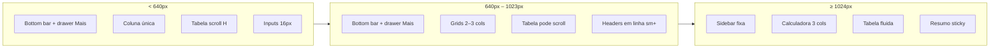

# Aplica Pro — Design Mobile (estado atual)

Documento de referência sobre **como a interface se comporta em telas pequenas** (smartphones e tablets em portrait). Descreve o que está implementado hoje no código, não uma spec futura.

**Relacionado:** [DESIGN_SYSTEM.md](./DESIGN_SYSTEM.md) (tokens, cores, componentes gerais).

**Stack:** React + Tailwind CSS v4 (mobile-first), Motion para animações.

---

## 1. Fundamentos

### 1.1 Viewport e base

- `index.html` define `viewport` com `width=device-width, initial-scale=1.0`.
- Tema escuro global (`slate-950`), fonte **Inter** + **JetBrains Mono**.
- Scrollbar customizada **somente em dispositivos com hover** (`@media (hover: hover)` em `src/index.css`) — em touch, o scroll nativo do sistema é usado.

### 1.2 Breakpoints Tailwind (usados no app)

| Prefixo | Largura mínima | Papel no Aplica Pro |
|---------|----------------|---------------------|
| *(default)* | &lt; 640px | **Mobile** — layout em coluna, menu drawer, tabelas com scroll horizontal |
| `sm:` | ≥ 640px | Ajustes de tipografia em inputs, grids 2–3 colunas em formulários, tabelas sem `min-width` forçado em alguns casos |
| `md:` | ≥ 768px | Headers em linha, perfil lado a lado, grids de calculadora em 2 colunas |
| `lg:` | ≥ 1024px | **Desktop** — sidebar fixa visível, sem hamburger, layout 2–3 colunas nas calculadoras |
| `xl:` | ≥ 1280px | Grids extras (ex.: custos em 4 colunas), auth com painel lateral mais estreito |

> O ponto de virada principal da **navegação** é **`lg` (1024px)**. Abaixo disso, o app usa **bottom bar** para rotas principais + **drawer lateral** para o restante do menu.

### 1.3 Padrão mobile-first nos inputs

Em quase todos os campos de texto/select:

```txt
text-base sm:text-sm
```

- **Mobile:** `16px` (`text-base`) — evita zoom automático no iOS ao focar o campo.
- **≥ sm:** volta para `14px` (`text-sm`), alinhado ao desktop.

---

## 2. Shell da aplicação (área logada)

**Arquivo:** `src/components/layout/AppLayout.tsx`

### 2.1 Diagrama — mobile (&lt; lg)

```
┌─────────────────────────────────────┐
│ [logo]  Título da rota     (sticky) │  ← top bar (sem hamburger)
│         Aplica Pro                    │
├─────────────────────────────────────┤
│                                     │
│   Conteúdo da rota                  │
│   padding: 16px (p-4)               │
│   + espaço inferior p/ bottom bar   │
│                                     │
├─────────────────────────────────────┤
│ Início │ Auto │ Orç. │ Deco │ Mais │  ← bottom navigation (fixa)
└─────────────────────────────────────┘
         ↑ safe-area-inset-bottom

[Menu "Mais" aberto]
┌──────────┬──────────────────────────┐
│ SIDEBAR  │░░░░ OVERLAY ░░░░░░░░░░░░░│
│ 256px    │░░░░ (blur + escurece) ░░░│
│ fixo     │░░░░ tap fecha ░░░░░░░░░░░│
└──────────┴──────────────────────────┘
```

### 2.2 Bottom navigation bar

Barra fixa na parte inferior (`fixed inset-x-0 bottom-0`), visível apenas abaixo de `lg`.

| Aba | Rota | Ícone | Papel |
|-----|------|-------|-------|
| **Início** | `/` | `LayoutDashboard` | Dashboard |
| **Auto** | `/automotivo` | `Car` | Calculadora automotiva |
| **Orçamento** | `/orcamento` | `History` | Histórico de orçamentos |
| **Deco** | `/decorativo` | `Home` | Calculadora decorativa |
| **Mais** | — (abre drawer) | `MoreHorizontal` | Custos, perfil, admin, gestão, logout |

**Estilo:**

- Altura mínima ~56px (`min-h-[3.5rem]`) por item — área de toque confortável.
- Ícone + rótulo `10px` empilhados; item ativo em `indigo-400` com fundo `indigo-600/15` no ícone.
- Fundo `slate-950/95` + `backdrop-blur-md`, borda superior `border-slate-900`.
- **`env(safe-area-inset-bottom)`** no padding inferior — respeita home indicator (iPhone).

**Top bar (complementar):**

- Sem botão hamburger — acesso ao menu completo só pela aba **Mais**.
- Logo 32px + título dinâmico da rota atual + tagline “Aplica Pro”.
- **`env(safe-area-inset-top)`** no padding superior.

### 2.3 Comportamento

| Elemento | Mobile / tablet (&lt; lg) | Desktop (≥ lg) |
|----------|---------------------------|----------------|
| Bottom bar | 5 abas fixas na base; rotas secundárias via **Mais** | Oculta (`lg:hidden`) |
| Sidebar (drawer) | Abre pela aba **Mais**; `fixed`, slide da esquerda | `static`, sempre visível (`w-64`) |
| Overlay | `fixed inset-0`, `bg-slate-950/70`, blur; fecha ao tocar | Não renderizado (`lg:hidden`) |
| Top bar | Título da página + logo; sticky no topo | Oculta |
| Botão fechar (X) | No topo da sidebar | Oculto |
| Main padding | `p-4` → `sm:p-6`; inferior extra `pb-[calc(4.5rem+safe-area)]` | `lg:p-8` |
| Troca de rota | Fecha o drawer automaticamente | — |
| Aba **Mais** ativa | Destacada em rotas do drawer: custos, perfil, catálogo, bases, `/admin/*` | — |

### 2.4 Animações

- Sidebar: `transition-transform 200ms ease-in-out`.
- Conteúdo: fade + `translateY(10px)` ao mudar de rota (200ms).

---

## 3. Tela de autenticação (`/entrar`)

**Arquivo:** `src/components/AuthPage.tsx`

### 3.1 Layout

| Viewport | Estrutura |
|----------|-----------|
| **&lt; lg** | Card em **coluna**: painel de marca em cima, formulário embaixo (`flex-col`) |
| **≥ lg** | Card em **linha**: painel esquerdo ~46% com recorte diagonal (`clip-path`), formulário à direita |

### 3.2 Detalhes mobile

- Container externo: `p-4 sm:p-6 lg:p-8`, `overflow-x-hidden`.
- Logo: `h-20` → `sm:h-24` → `lg:h-28`.
- Títulos e painel de marca: centralizados no mobile; alinhados à esquerda a partir de `lg`.
- Cadastro em etapas: indicador `grid-cols-3` com gaps `gap-2 sm:gap-3`.
- Endereço (`AddressFields`): CEP/cidade em `grid-cols-1 sm:grid-cols-2`; número/bairro/UF em `sm:grid-cols-3`.
- Lista de regras de senha: `grid-cols-1 sm:grid-cols-2`.

---

## 4. Páginas por módulo

### 4.1 Dashboard (`/`)

**Arquivo:** `src/components/DashboardOverview.tsx`

- Header: coluna no mobile; linha com botões à direita a partir de `sm`.
- Botões de ação: `w-full` no mobile, `sm:w-auto` no tablet+.
- Cards de métricas: `grid-cols-1` → `md:grid-cols-3`.
- Gráficos / blocos inferiores: `grid-cols-1` → `lg:grid-cols-2`.
- Títulos: `text-2xl` → `sm:text-3xl`.

### 4.2 Custos (`/custos`)

**Arquivo:** `src/components/CostsOverview.tsx`

- Header com CTA “Salvar”: empilhado; botão `w-full sm:w-auto`.
- Cards de parâmetros: `grid-cols-1` → `md:grid-cols-2` → `xl:grid-cols-4`.
- `pb-20` no container — espaço extra no fim para não cortar conteúdo atrás de barras do sistema.

### 4.3 Calculadoras — Automotivo e Decorativo

**Arquivos:** `AutomotiveCalculator.tsx`, `DecorativeCalculator.tsx`

Padrão compartilhado:

```
┌─ Header (coluna → sm: linha) ─────────────┐
│ Título + ícone    [Salvar — full width]  │
└──────────────────────────────────────────┘
┌─ Grid principal ─────────────────────────┐
│  MOBILE: 1 coluna                        │
│  LG: 2/3 formulário + 1/3 resumo sticky  │
└──────────────────────────────────────────┘
```

| Área | Mobile | Tablet (sm/md) | Desktop (lg+) |
|------|--------|----------------|---------------|
| Header | Coluna; botão salvar largura total | Linha; botão auto | Igual tablet |
| Cliente / veículo | 1 coluna | `md:grid-cols-2` | — |
| Selects marca/modelo/ano | 1 coluna | `sm:grid-cols-3` | — |
| Tipo orçamento (Completo/Parcial) | Botões empilhados (`flex-col`) | `sm:flex-row` | — |
| Grade de peças | `grid-cols-2` | `md:grid-cols-3` | — |
| Itens decorativos (linha de medidas) | 1 coluna | `md:grid-cols-12` (colunas proporcionais) | — |
| Painel de totais | Abaixo do formulário | — | `lg:sticky lg:top-8` na coluna direita |

### 4.4 Histórico de orçamentos (`/orcamento`)

**Arquivos:** `BudgetHistory.tsx`, `BudgetDetailDrawer.tsx`

**Lista (mobile):**

- Filtros e busca: coluna (`flex-col md:flex-row`); busca `w-full`, filtros `w-full md:w-auto`.
- Tabela: **scroll horizontal** com `min-w-[720px]` abaixo de `sm`, depois `sm:min-w-0`.
- Wrapper: `overflow-x-auto -mx-4 px-4` no mobile (usa largura da tela); `sm:mx-0` remove o “bleed”.

**Drawer de detalhes (mobile-friendly por design):**

- Painel desliza da direita (`x: 100%` → `0`), largura `w-full max-w-md` — em telas estreitas ocupa **quase a tela inteira**.
- Overlay escuro com blur; toque fora fecha.
- Métricas em `grid-cols-2`.
- Ações fixas no rodapé do drawer (PDF + excluir).

> No mobile, o fluxo principal para ver detalhes é o **drawer**, não uma página separada.

### 4.5 Perfil (`/perfil`)

**Arquivo:** `src/components/ProfileView.tsx`

- Hero do perfil: foto + textos **centralizados** no mobile; `md:flex-row` e `md:text-left` no tablet+.
- Badges de especialidade: `justify-center` → `md:justify-start`.
- Formulários: `grid-cols-1` → `md:grid-cols-2`; especialidades `md:grid-cols-2 lg:grid-cols-3`.
- Upload de foto: hover com câmera (em touch o hover não existe — o botão de upload ainda funciona via `input` oculto).

### 4.6 Gestão — Catálogo, Veículos, Eletros

**Arquivos:** `CatalogPage.tsx`, `VehiclesPage.tsx`, `AppliancesPage.tsx`, `PageHeader.tsx`, `DataTable.tsx`

**Cabeçalho (`PageHeader`):**

- Título + descrição empilhados; ações com `flex-wrap` abaixo de `lg`.
- H1: `text-xl` no mobile → `lg:text-2xl`.

**Tabela (`DataTable`):**

- Busca: sempre largura total.
- Container com scroll horizontal; `min-w-[600px]` no mobile, removido em `sm+`.
- **Dica visual de scroll:** gradiente à direita (`w-8`, `sm:hidden`) — só no mobile, indica que há mais colunas.
- Cabeçalho sticky dentro do scroll vertical (`max-h-[calc(100vh-20rem)]`).
- Colunas secundárias podem usar `hidden sm:table-cell` (ex.: tabela de veículos).

**Formulários de edição (linha expandida / lote):**

- Grids: `grid-cols-1` → `sm:grid-cols-2` → `lg:grid-cols-3/4` conforme a página.

### 4.7 Settings legado (`SettingsPageHeader`)

Usado em fluxos antigos de configuração:

- Header: `flex-col sm:flex-row` com padding `p-6 sm:p-8`.
- CTA: `justify-center` no mobile, largura automática no `sm+`.

---

## 5. Padrões transversais

### 5.1 Headers de página

Padrão recorrente em calculadoras, dashboard e custos:

```txt
flex flex-col gap-4
sm:flex-row sm:justify-between sm:items-center
```

- Título e subtítulo sempre legíveis no topo.
- Botão primário ocupa **largura total** no mobile.

### 5.2 Tabelas em telas estreitas

Estratégia atual: **não** transformar tabela em cards — usar **scroll horizontal** + largura mínima.

| Componente | min-width mobile | Scroll hint |
|------------|------------------|-------------|
| `DataTable` | 600px | Gradiente direita (`sm:hidden`) |
| `BudgetHistory` | 720px (&lt; sm) | Margem negativa `-mx-4` |

**Implicação UX:** o usuário precisa deslizar horizontalmente para ver todas as colunas. Colunas menos críticas podem ficar ocultas até `sm` em algumas telas.

### 5.3 Drawers e modais

| Componente | Comportamento mobile |
|------------|----------------------|
| `BudgetDetailDrawer` | Full-height, `max-w-md`, slide da direita, spring animation |
| Sidebar menu | Slide da esquerda + overlay; aberto via aba **Mais** |
| Bottom navigation | Fixa na base; 4 rotas diretas + **Mais** |
| Sem bottom sheet nativo | — |

### 5.4 Espaçamento inferior

- **`AppLayout`** reserva `pb-[calc(4.5rem+env(safe-area-inset-bottom))]` no `<main>` mobile — evita que conteúdo fique atrás da bottom bar.
- Várias páginas mantêm **`pb-20`** adicional no container interno (legado / margem extra em formulários longos e home indicator).
- A bottom bar já aplica `safe-area-inset-bottom`; a top bar usa `safe-area-inset-top`.

### 5.5 Colapsáveis

`CollapsibleSection.tsx`: cabeçalho com área de toque ampla (`p-6`), título truncado, ações laterais não disparam toggle (stopPropagation).

---

## 6. Mapa visual por breakpoint



---

## 7. O que ainda não está otimizado para mobile

Itens observados no código atual — úteis para backlog de design/dev:

| Área | Situação atual |
|------|----------------|
| Tabelas | Scroll horizontal, sem variante “card list” para mobile |
| Calculadora — muitas peças | Grade `grid-cols-2` pode ficar apertada em telas &lt; 360px |
| Hover-only | Upload de foto no perfil depende de `group-hover` para mostrar câmera |
| Touch targets | Bottom bar ~56px; ícones de ação na tabela ainda sem `min-h`/`min-w` explícitos de 44px |
| Bottom bar — 5 abas | Labels curtos (“Auto”, “Deco”); telas &lt; 320px podem truncar rótulos |
| Landscape phone | Não há layout específico; herda o mesmo que portrait |
| Testes visuais | Não há documentação de dispositivos-alvo (ex.: iPhone SE, Galaxy A) |

---

## 8. Checklist rápido para designers

Ao propor telas mobile no Figma, alinhar com o implementado:

1. **Largura de referência:** 375px (iPhone) e 390px; validar também 320px.
2. **Navegação:** bottom bar com 5 abas (Início, Auto, Orçamento, Deco, Mais) + drawer lateral 256px para o restante.
3. **CTAs principais:** largura total abaixo de `sm`.
4. **Inputs:** altura ~40px (`h-10`), fonte 16px no mobile.
5. **Tabelas:** prever scroll horizontal ou colunas ocultas com `hidden sm:table-cell`.
6. **Detalhe de orçamento:** painel lateral direito (drawer), não página full.
7. **Tema:** manter dark (`slate-950` / `slate-900`); indigo para ações gerais e nav ativa, emerald para gestão.
8. **Safe area:** reservar inset superior (top bar) e inferior (bottom bar + home indicator).

---

## 9. Arquivos de referência no código

| Responsabilidade | Arquivo |
|------------------|---------|
| Shell + bottom bar + drawer | `src/components/layout/AppLayout.tsx` |
| Estilos globais + scrollbar | `src/index.css` |
| Login / cadastro | `src/components/AuthPage.tsx` |
| Endereço responsivo | `src/components/AddressFields.tsx` |
| Tabela com scroll | `src/components/settings/DataTable.tsx` |
| Drawer de orçamento | `src/components/BudgetDetailDrawer.tsx` |
| Histórico + tabela | `src/components/BudgetHistory.tsx` |
| Calculadoras | `src/components/AutomotiveCalculator.tsx`, `DecorativeCalculator.tsx` |
| Header gestão | `src/components/settings/PageHeader.tsx` |

---

## 10. Changelog

| Data | Alteração |
|------|-----------|
| 2026-06-02 | Bottom navigation bar no mobile/tablet; top bar sem hamburger; safe-area insets; drawer via aba **Mais**. |
| 2026-05-27 | Documento inicial descrevendo o estado mobile implementado no repositório. |

---

*Gerado a partir do código em `aplica-pro`. Para tokens de cor e tipografia, ver [DESIGN_SYSTEM.md](./DESIGN_SYSTEM.md).*
